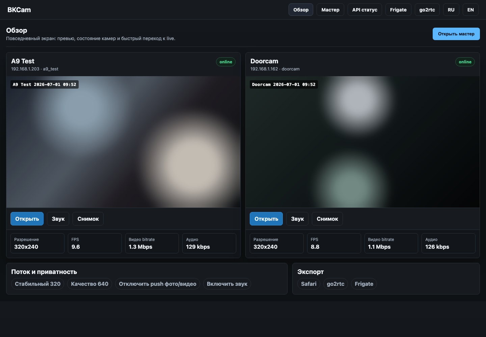

<p align="right"><a href="README.md"><kbd>Русский</kbd></a></p>

# BK7252N Gate

Local gateway for cheap BK7252N/A9 PPPP cameras. It keeps local camera sessions alive and exposes a practical web UI, MJPEG video, WAV/raw PCM audio, snapshots, status JSON and generated go2rtc/Frigate configs.

Camera reflashing is not required. UART is not required for normal setup either: the wizard talks to the stock camera firmware over Wi-Fi through the local PPPP protocol.



<sub>The screenshot shows a demo state of the current UI. Real previews and FPS depend on the cameras, Wi-Fi quality and selected stream profile.</sub>

## Features

- Multi-camera overview with compact previews.
- Camera live page that opens directly in Safari/Chrome.
- Browser audio plus separate WAV/raw PCM endpoints.
- Step-by-step offline camera setup wizard for camera AP provisioning.
- Write Wi-Fi settings to the camera over Wi-Fi, without UART.
- Simple stream presets: stable 320 and quality 640.
- Privacy controls for disabling camera push photos/videos.
- Optional image overlays: camera name, date/time, FPS/stream diagnostics.
- Generated `/frigate.yml` and `/go2rtc.yml`.
- Status API for health, restarts, FPS, bitrate and fresh/stale diagnostics.

## Quick Start

Go 1.24 or newer is required.

```bash
git clone https://github.com/aklyk/bk7252n-gate.git
cd bk7252n-gate
cp bkcam-server/config.example.json bkcam-server/config.json
```

Edit `bkcam-server/config.json`: set camera IPs, names and desired resolution. For cameras with DID prefix `EEE`, the local PPPP PSK is usually `SHIX`.

Start:

```bash
./start.sh
```

Stop:

```bash
./stop.sh
```

Then open:

```text
http://<server-ip>:8088/
```

`start.sh` builds the Go backend when needed. If `screen` is installed, the service runs in `screen`. Without `screen`, it falls back to `nohup` and `.bkcam.pid`. `stop.sh` handles both modes and also searches by port.

For development:

```bash
cd bkcam-go
go run .
```

## Adding A Camera

If the camera is already on your Wi-Fi:

1. Open the web UI.
2. Click `Open wizard`.
3. Enter ID, name, current camera IP and final LAN IP.
4. Save the profile.

If the camera is new and exposes its own AP:

1. Open this page from the local server.
2. Connect the laptop to the camera Wi-Fi AP.
3. In the wizard, enter the current camera address, target Wi-Fi SSID and password.
4. The wizard sends `set_wifi` to the camera and saves the local profile.
5. Connect the laptop back to your normal Wi-Fi and open the overview page.

Fixed DHCP leases are recommended. Use unicast `discovery` equal to each camera IP, so one camera cannot accidentally occupy another camera card.

## Useful URLs

```text
/                    web UI
/setup               new-camera wizard
/api/status          service status JSON
/cam/<id>            camera page
/cam/<id>/video.mjpg MJPEG video
/cam/<id>/audio.wav  WAV audio
/cam/<id>/audio.raw  raw PCM audio
/cam/<id>/snapshot.jpg
/frigate.yml         Frigate config
/go2rtc.yml          go2rtc config
```

## Frigate And go2rtc

Open:

```text
http://<server-ip>:8088/frigate.yml
http://<server-ip>:8088/go2rtc.yml
```

The gateway exposes MJPEG video and PCM/WAV audio. go2rtc/ffmpeg can restream that as H.264/AAC/Opus so Frigate receives one RTSP stream with video and sound.

For multiple cameras, start with `320x240`. If Wi-Fi is solid, switch selected cameras to `640x480`.

## Privacy And Cloud Blocking

The safest setup is to block camera WAN egress on the router and allow only LAN traffic between cameras and this gateway.

Firmware dump and local camera parameters showed these external targets:

```text
120.79.76.240:9093   hardcoded cypush login endpoint
120.76.44.223:9093   push_ip/push_port observed on the test camera
cn.ntp.org.cn        firmware NTP fallback
cn.pool.ntp.org      firmware NTP fallback
ntp1.aliyun.com      firmware NTP fallback
114.114.114.114      DNS CLI example, block defensively if desired
```

`ilnk.work` was not found as a plaintext string in the checked camera dump, but it is still a reasonable defensive block for iLnk/PPCS clients or app traffic.

Example OpenWrt WAN block:

```sh
uci add firewall rule
uci set firewall.@rule[-1].name='Block BKCam WAN'
uci set firewall.@rule[-1].src='lan'
uci add_list firewall.@rule[-1].src_ip='192.168.1.162'
uci add_list firewall.@rule[-1].src_ip='192.168.1.203'
uci set firewall.@rule[-1].dest='wan'
uci set firewall.@rule[-1].target='REJECT'
uci commit firewall
/etc/init.d/firewall reload
```

DNS-level block only:

```sh
uci add_list dhcp.@dnsmasq[0].address='/cn.ntp.org.cn/0.0.0.0'
uci add_list dhcp.@dnsmasq[0].address='/cn.pool.ntp.org/0.0.0.0'
uci add_list dhcp.@dnsmasq[0].address='/ntp1.aliyun.com/0.0.0.0'
uci add_list dhcp.@dnsmasq[0].address='/ilnk.work/0.0.0.0'
uci commit dhcp
/etc/init.d/dnsmasq restart
```

Firmware details and parameter notes: [`docs/research/a9_stock_firmware_dump.md`](docs/research/a9_stock_firmware_dump.md).

## Repository Layout

- `bkcam-go/` - main Go backend, web UI and PPPP gateway.
- `bkcam-server/` - legacy Node.js gateway and local config path.
- `PPPP/` - JavaScript PPPP client based on A9_PPPP.
- `a9serv/` - small C MJPEG/WAV fallback proxy.
- `aiopppp/` - Python PPPP reference implementation.
- `pppp-dissector/` - Wireshark dissector and PPPP notes.
- `docs/` - handoff, reverse-engineering and research notes.

Local configs, firmware dumps, packet captures and generated archives are intentionally not tracked.

## Safety

Use this project only with cameras you own and operate on your own network. It is a local gateway for replacing cloud dependency, not a tool for accessing third-party devices.

## Licenses

This repository contains modified/reference code from multiple upstream projects. Before redistributing derived work, check `NOTICE.md` and per-folder license/readme files.
